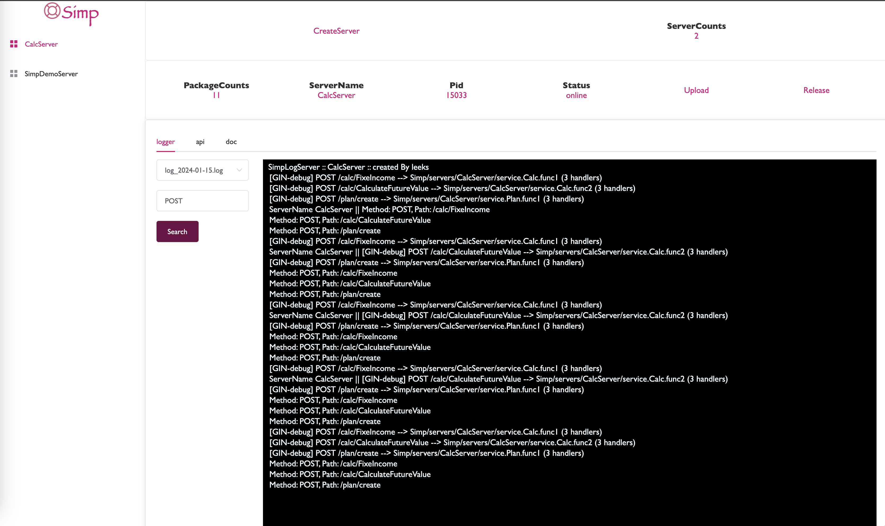

# Simp



1. 我喜欢TAF Web化的部署方式。
2. 我喜欢TRPC 简洁的开发模式
3. TAF太重了，作为使用TAFNode进行日常开发的程序员，也会经常遇到自己不能hold住的问题。

我想让所有事情都简单化。能不能将所有东西都弄简单一点。不想背八股文。

1. 我还是很喜欢TAF的Web化部署方式，重点是，我爱JavaScript！
2. 部署平台不能过多的涉及业务。TAF平台里所展示的一些东西其实和业务也是有绑定的，这使得开发者得花过多的时间去研究和了解。
3. 通信我觉得都采用HTTP就可以了，流量带宽的，很多时候并不需要去考虑。

配置采用 yaml的形式

````yaml
server:
  name: SimpServer
  port: 8080
  type: main
  staticPath: static # 静态资源
  storage:  mysql@3306...... # 存储
  proxy:
    - server:
        type: fass # 选择Fass时默认代表本地，并且！，冷启动！，不能包含定时器等玩意，
        name: FassServer
    - server:
        type: http
        port: 9091
        name: StudentServer
````

## START

````shell
# Step 1
# 拉取主控服务 
git clone https://github.com/chelizichen/Simp.git;
# 直接启动
go run main.go

# Step2
# 定位到 Simp/servers
cd servers
# 创建服务
mkdir TestServer
# 创建配置文件
# server:
#   name: TestServer
#   port: 8511
#   type: main
#   staticPath: static # 静态资源
#   storage:  mysql@3306...... # 存储
touch simp.yaml

# 创建入口文件
# 开发人员手动补全 service.Test 
# package main
# import (
# 	h "Simp/handlers/http"
# 	"Simp/servers/TestServer/service"
# )
# func main() {
# 	ctx := h.NewSimpHttpCtx("simp.yaml")
# 	// ctx.Use(service.Test)
# 	h.NewSimpHttpServer(ctx)
# }
touch main.go

# 构建
go build -o service_go
# 压缩 
# 注意！ 包名需要和 simp.yaml - server - name 相同
tar -cvf TestServer.tar.gz ./simp.yaml ./service_go

# 进入 localhost:8080/web/
# 发布创建服务、上传服务包、发布服务！

````

## PRODUCTION

先编译打包主控服务
注意：编译前需要定义好环境变量
才能发布至云上

````sh
#!/bin/bash  

# if permission denied
# run script with ` chmod +x build.sh ` 
readonly ServerName="SimpServer"

# rm
rm ./$ServerName.tar.gz ./service_go

# compile
GOOS=linux GOARCH=amd64 go build -o service_go

# build
tar -cvf $ServerName.tar.gz ./simp.yaml ./service_go ./static ./pages
````
