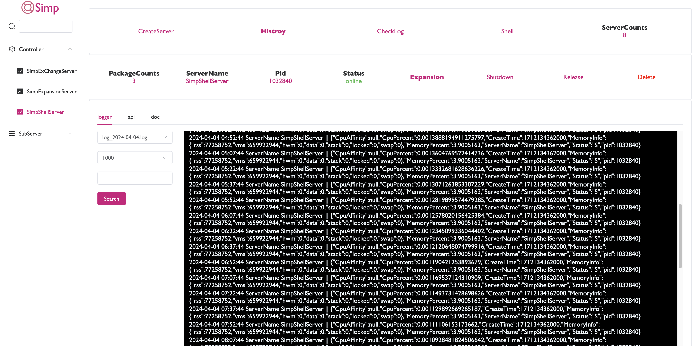
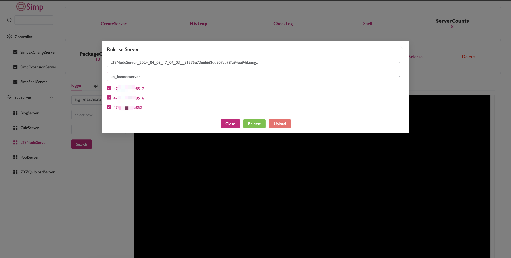
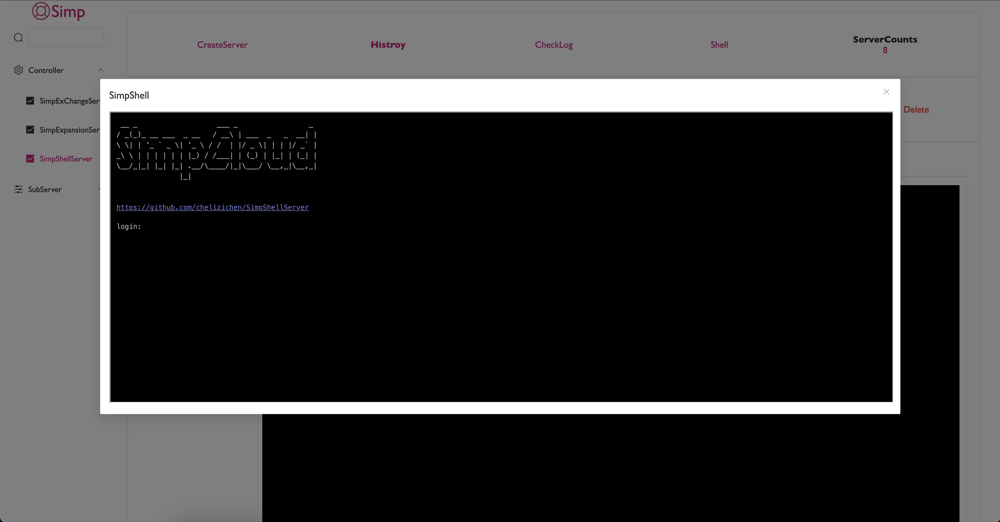

<h2 align="center">Simp</h2>



***
- **包括的子服务**
  - [扩容服务](https://github.com/chelizichen/SimpExpansionServer)该服务可以对其他业务服务进行水平扩容
  - 
  - [Shell服务](https://github.com/chelizichen/SimpShellServer)该服务可以模拟Shell 用来查看文件
  - 

**START**

- [介绍](#介绍)
- [配置文件](#配置文件)
- [使用](#使用)
- [发布](#发布)

##### 介绍

Simp是一个快速发布、部署的现代Web平台,类似于[Tars](https://github.com/TarsCloud/Tars),采用[gin](https://github.com/gin-gonic/gin) + [vue](https://github.com/vuejs/vue)进行底层平台的构建。该平台以部署简单，无需MySql,无需安装其他环境,只需要将二进制文件和静态资源部署至云平台即可。同时含有日志系统，日志分为主控和子服务日志，两者可以随时查看。

##### 配置文件

配置采用 yaml的形式

````yaml
server:
  name: SimpServer #服务名
  port: 8080 
  host: 0.0.0.0  
  type: main 
  staticPath: static # 静态资源路径
  storage:  mysql@3306...... # 存储，参考sqlx写法
````

##### 使用

````shell
# Step 1
# 拉取主控服务 
git clone https://github.com/chelizichen/Simp.git;
# 直接启动
go run main.go

# Step2
# 定位到 Simp/servers
cd servers
# 创建服务
mkdir TestServer
# 创建配置文件
# server:
#   name: TestServer
#   port: 8511
#   type: main
#   staticPath: static # 静态资源
#   storage:  mysql@3306...... # 存储
touch simp.yaml

# 创建入口文件
# 开发人员手动补全 service.Test 
# package main
# import (
# 	h "Simp/src/http"
# 	"Simp/servers/TestServer/service"
# )
# func main() {
# 	ctx := h.NewSimpHttpCtx("simp.yaml")
# 	// ctx.Use(service.Test)
# 	h.NewSimpHttpServer(ctx)
# }
touch main.go

# 构建
go build -o service_go
# 压缩 
# 注意！ 包名需要和 simp.yaml - server - name 相同
tar -cvf TestServer.tar.gz ./simp.yaml ./service_go

# 进入 localhost:8080/web/
# 发布创建服务、上传服务包、发布服务！

````

##### 发布

先编译打包主控服务
注意：编译前需要定义好环境变量
才能发布至云上

````sh
#!/bin/bash  

# if permission denied
# run script with ` chmod +x build.sh ` 
readonly ServerName="SimpServer"

# rm
rm ./$ServerName.tar.gz ./service_go

# compile
GOOS=linux GOARCH=amd64 go build -o service_go

# build
tar -cvf $ServerName.tar.gz ./simp.yaml ./service_go ./static ./pages
````
